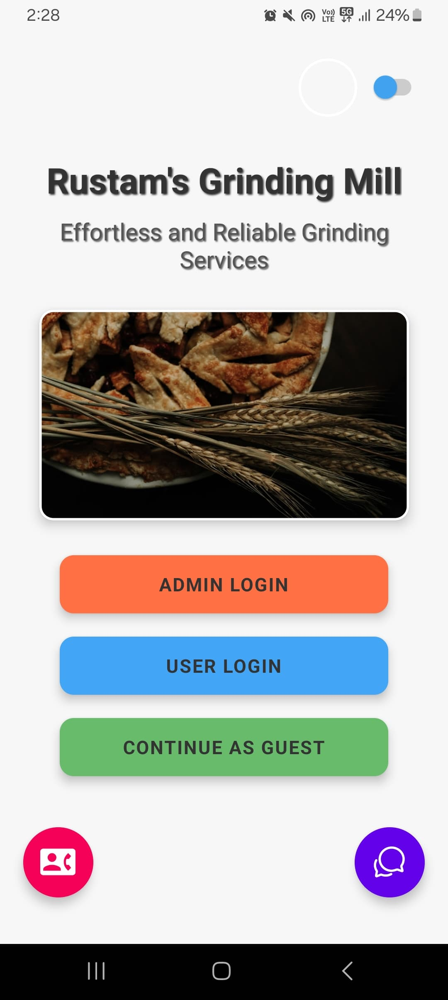
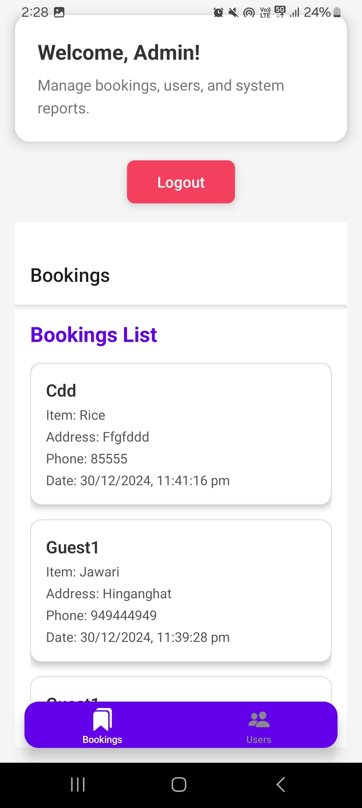
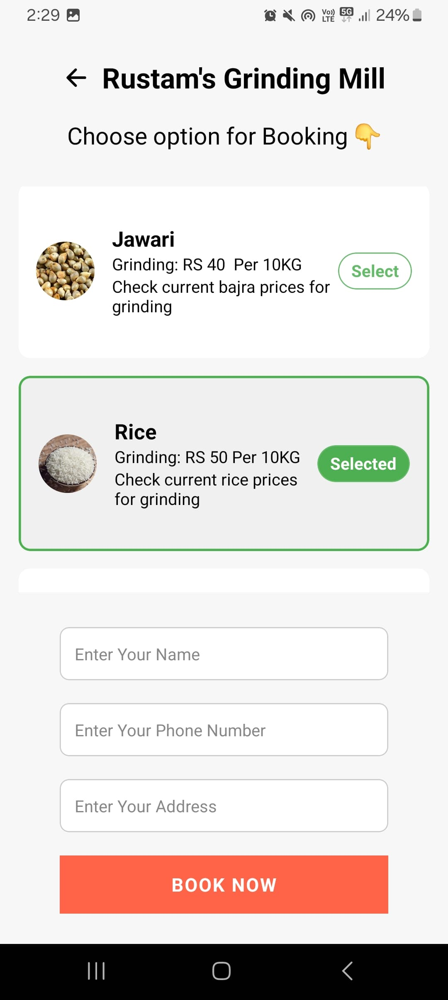
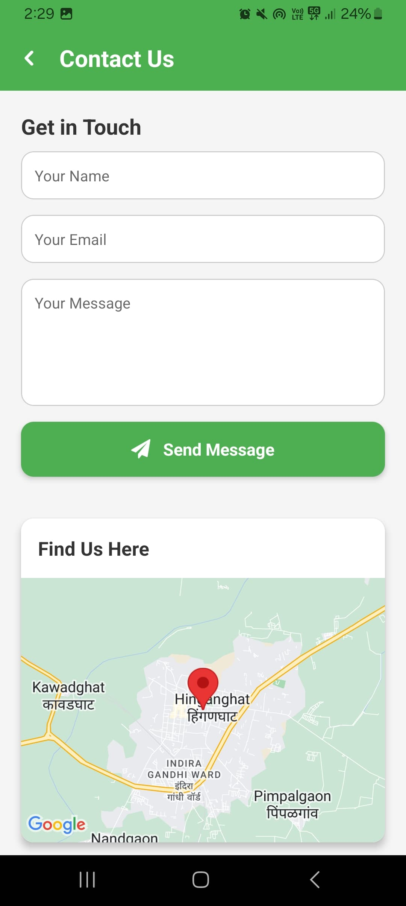
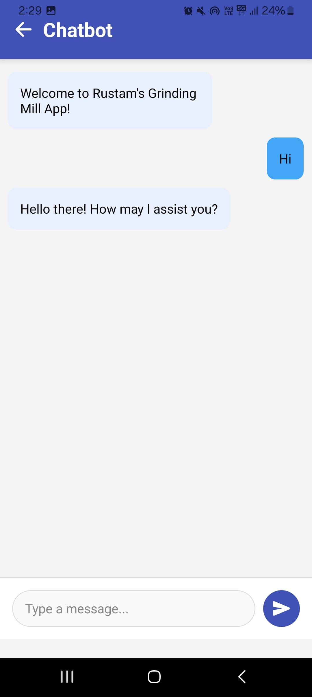

# Rustam's Mill - Frontend (React Native)

This is the **React Native frontend** for **Rustam's Mill**, providing a mobile application for users to interact with the grinding mill services. The application is designed for a smooth, mobile-first experience on both **Android** and **iOS** platforms.

## APK Download

You can download the APK file for the **Rustam's Mill** mobile app from the link below:

[Download APK](https://github.com/zuberkhan01st/Rustams_Mill_Frontend/raw/main/File/application-95beb1da-58f0-4a06-91e1-af1b3a0fca52.apk)

---

---


## Demo Screenshots

### Home Screen and Admin Login Screen
<div style="display: flex; justify-content: space-around;">
  
  
</div>

---

### User Screen Login
<div style="display: flex; justify-content: space-around;">
  
  
</div>

---

### Admin Dashboard Screen and Booking Screen
<div style="display: flex; justify-content: space-around;">
  
  
</div>

---

### Chatbot Screen and Contact Us Screen
<div style="display: flex; justify-content: space-around;">
  
  
</div>

---

### Raise Grievance Screen & Related Mail
<div style="display: flex; justify-content: space-around;">
  
  
  
</div>

---


## Features

- **Mobile-first experience** for both **Android** and **iOS** platforms.
- **Booking grinding services**: Users can easily book services through the app.
- **Viewing service history**: Users can track their past orders.
- **Real-time updates** on orders: Notifications for order status and updates.
- **Contacting the mill**: A simple form to get in touch with the mill for inquiries.
- **Smooth navigation**: Users can navigate between different screens with ease.
- **Responsive design**: Optimized for various screen sizes and devices.
- **Integrated with the backend API**: Fetches dynamic data from the backend and displays it in real-time.

---

## Technology Stack

- **React Native**: For cross-platform mobile app development.
- **Expo**: Provides development and build tools for React Native apps.
- **Axios**: Used for making API requests and handling responses.
- **React Navigation**: For navigating between different screens in the app.
- **React Native Maps**: For integrating map functionality (optional, if needed for locating services).
- **React Native Paper**: For consistent and beautiful UI components.
- **React Context or Redux**: For state management (if required).
- **Formik**: For managing forms, like the contact us form.

---

## Project Structure

```plaintext
Rustams_Mill_Frontend/
├── assets/          # Images, fonts, and other static assets
├── src/             # Source files
│   ├── components/  # Reusable UI components
│   ├── screens/     # Individual app screens
│   ├── navigation/  # Navigation configurations
│   ├── styles/      # Styling files
│   └── App.js       # Main application entry point
├── .gitignore       # Files and folders to be ignored by Git
├── package.json     # Project dependencies and scripts
└── README.md        # Documentation for the frontend
